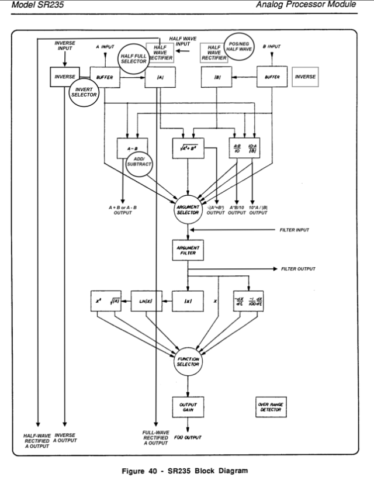

# L-235 Analog Processor ##

### Introduction ###
I was interested in the SR-235 as being the equivalent mathematical processor but then in Analog form which I saw in action on Hainbach's channel using this test equipment here: https://www.youtube.com/watch?v=PS_cn9-rgEs 
Also coming from a digital synthesis world using a Kurzweil K2000R Synthesizer years ago which has an awesome VAST engine with mathematical functions called FUN to combine 2 signals and apply mathematical functions on it, I still was searching for an equivalent module in eurorack but did not find any yet.

So I decided to give it a go and build a eurorack DIY version of this module to have these interesting functions available for waveform manipulation in eurorack.

I found the schematics of the SR-235 with courtesy of Stanford Research Systems:
https://www.thinksrs.com/downloads/pdfs/manuals/Boxcarm.pdf

### Main principe ###

The analog processor uses a 4 deck rotary switch to change the algorith and function. This creates different inputs paths to each IC or opamp circuitry to change the way the voltages are handled. One of the IC's is a precision multipier, the AD534. It can be bought second hand for 10 euros, but newer versions go for a whopping 200 euros. Luckily there is a cheaper version available as SMD version (AD633) which is also 10 euros. By adding an extra opamp to the Z input, you basically have the same circuit. 
The A and B inputs are full wave rectified. This is a falstad testing the out the first circuit path: [Full wave rectification test setup](https://tinyurl.com/27wkvqkx)

### Added functionalities ###

#### 1. Continuous Argument Filter X with reduced range ####
I reached out to Hainbach who was willing to share some photographs on the internals so I could look for the same brand of components.
I also incorporated his suggestion of changing the filter to a continous potentiometer and limit it to the first 3 steps (0-1M Ohms) to keep it in the audible range.

#### 2. Normalized Patch points before and after each circuit #### 
I wanted to include as many patch points as possible to have a plethora of normalised extra in/outputs on each of the different circuit blocks which are already in the SR-235. Thaty way it can be used as an ARP2600/MS-20 type of pre-routed unit and be able to use a single part of the chain if needed.

#### 3. Bi Polar Half Wave rectification ####
Beside the existing circuits already in the module like full wave rectification, a bi polar half wave option to switch to is also added.
I took inspiration of these nice utility modules where for example the CFM can be utilised to add to separate positive and negative half waves to create new waveshapes easily:
- [Mutable Kinks](https://pichenettes.github.io/mutable-instruments-documentation/modules/kinks/) Signal prep: Invert/Half Wave/Full Wave
- [BiPolar Half Wave Rectifier](http://www.cfmodular.com/BHWR)

To be able to combine new rectified waveshapes I decided to add switches for inversion and positive/negative half wave rectification so the main signal chain can easily be changed.

#### 4. Inverse waveform circuit #### 
I've also added a separate circuit with dedicated in/outputs to be able to inverse the waveform so you have more options to prepare the waveform before going into the functions or use it as a separate circuit.

#### 5. Switch for ADD/Subtract function #### 
To be able to also combine two half waves, I added also an Add/Subtract switch for the A - B Argument.

#### 6. CV control over the selected Argument and Function
A eurorack conversion wouldn't be complete with complete CV control over everything. Therefore I've added CV control to select different circuits via a multiplexer and using a 3-bit Flash ADC to have proper audio rate speed (hopefully!)
- [3-bit Flash ADC test](https://tinyurl.com/2b6dmdgn)

### Schematic overview of functions with in/outputs ###
